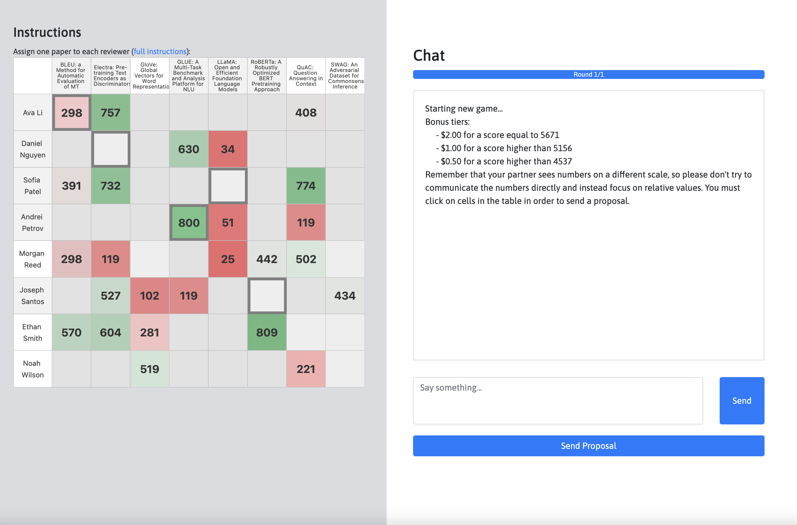
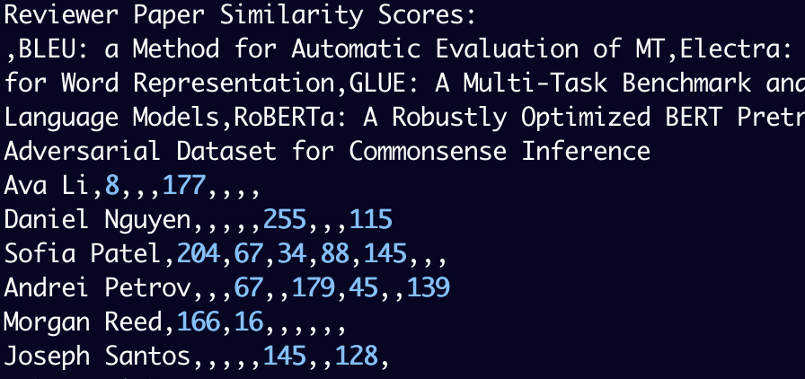
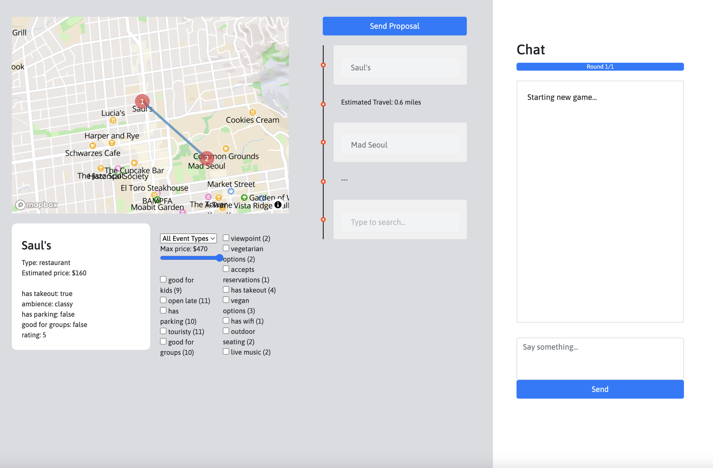
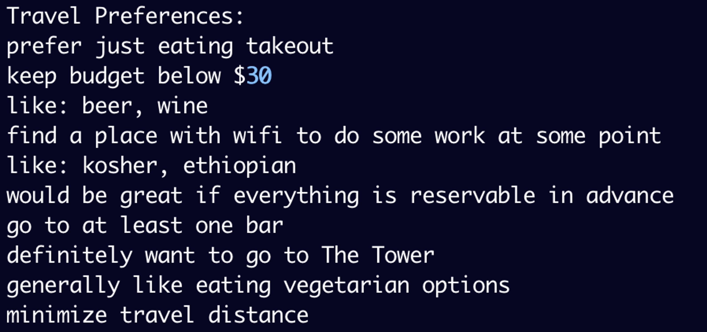
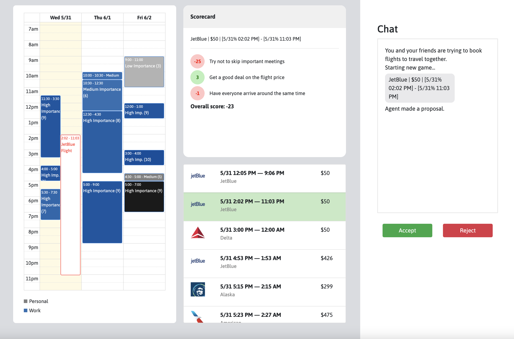

# 📠 The DialOp Environments

_Collaborative decision-oriented dialogue environments for humans and LLM agents._

These environments are associated with the paper **Decision-Oriented Dialogue For Human-AI Collaboration**.

[[Paper]](https://arxiv.org/abs/2305.20076)
[[Website]](https://collaborative-dialogue.github.io/)


# Play against GPT-3

Get started and play the games with GPT-3 as an assistant:
```
pip install -e .
vim dialop/.api_key
python dialop/play_gpt3.py --game {optimization, planning, mediation}
```

# Overview

<p align="center">

</p>

- `games`: define game logic, environment data generation
- `envs`: text-based interfaces for games
- `apps`: web app interfaces for games for human-human play


| Name         | Description   | Human UI           | Agent Text Interface | Hosted UI             |
| ------------ | ------------- | ------------------ | --------------------------------- | ------- |
| `Optimization` | Assign the best reviewers for conference papers |  |  | [Play now](http://reviewer-matching.herokuapp.com/) |
| `Planning` | Plan the best itinerary with the least travel and price |  |  | [Play now](https://itinerary-planning.herokuapp.com/)
| `Mediation` | Coordinate a set of group flights that works well for everyone |  |  | [Play now](https://collaborative-dialogue.herokuapp.com/)

**To play against yourself with the text-based environment:**
```
python dialop/play.py --game {optimization, planning, mediation}
```
**To play against yourself with the web UI:**
```
cd dialop/apps
game={optimization, planning, mediation} flask run
```
For Planning, you'll need to input a MapboxGL access key in `static/client.js` and `static/map.js` to show the map on the agent side and access other map features.

# Human-Human Dialogues

To see human-human dialogues:
```
unzip dialop/data.zip
```

# Self-Play and Prompted Self-Play Evaluation

Coming soon!

# Citation
```
@article{lin2023decision,
  title={Decision-Oriented Dialogue for Human-AI Collaboration},
  author={Lin, Jessy and Tomlin, Nicholas and Andreas, Jacob and Eisner, Jason},
  journal={arXiv preprint arXiv:2305.20076}
  year={2023}
}
```

# License
The data license is available under [LICENSE.md](/LICENSE.md).